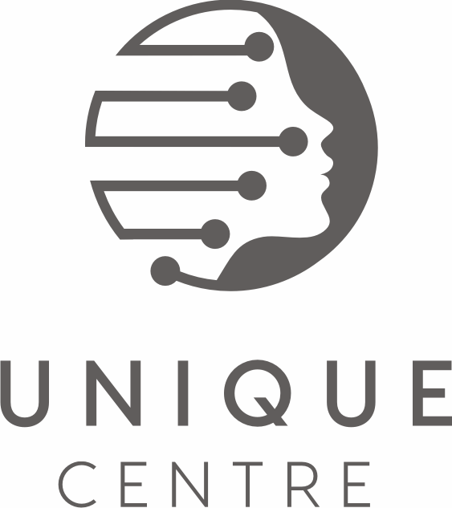

**Organizers:** Bertrand Thirion, Elizabeth DuPre, Gaël Varoquaux, Jérôme Dockès, Kshitij Chawla, Thomas Bazeille.

Please contact the [Nilearn Events](mailto:nilearn.events@gmail.com) team if you have questions, or want to participate in any of the events.

**Supported by**

This event benefits from the European Union’s Horizon 2020 Research and
Innovation Programme under Grant Agreement HBP SGA3, and well as support
from the UNIQUE center, Unifying AI and Neuroscience – Québec.
